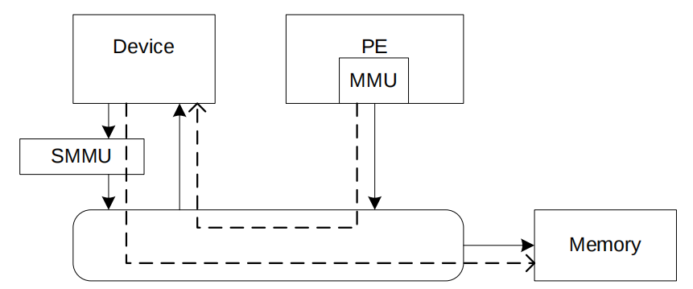
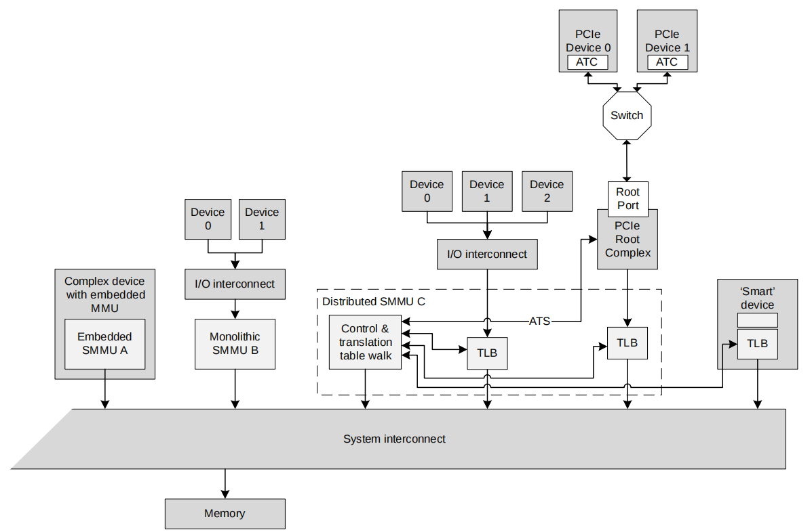

# SMMUV3


## Introduction

A *System Memory Management Unit* (SMMU) performs a task that is analogous to that of an MMU in a PE, translating addresses for DMA requests from system I/O devices before the requests are passed into the system interconnect. It is active for DMA only. Traffic in the other direction, from the system or PE to the device, is managed by other means – for example, the PE MMUs.



Several SMMUs might exist within a system. An SMMU might translate traffic from just one device or a set of devices. The SMMU supports two stages of translation in a similar way to PEs supporting the Virtualization Extensions. Each stage of translation can be independently enabled. An incoming address is logically translated from VA to IPA in stage 1, then the IPA is input to stage 2 which translates the IPA to the output PA. Stage 1 is intended to be used by a software entity to provide isolation or translation to buffers within the entity, for example DMA isolation within an OS. Stage 2 is intended to be available in systems supporting the Virtualization Extensions and is intended to virtualize device DMA to guest VM address spaces.


## SMMU device

The form of SMMU in SOC is not fixed and depends on the design of the chip manufacturer. When an SOC is equipped with an SMMU, the system architecture changes, and some bus nodes are hidden behind the SMMU, becoming its Client Device.

As shown in the figure, an SOC can contain multiple SMMUs, with different devices connected to different SMMUs. Devices not connected to an SMMU cannot use it for address translation.




## StreamID

PCIe devices use BDF (Bus/Device/Function) as the base value for StreamID, sid = (B << 5) | (D << 3) | F. The StreamID for other devices is defined by the SoC vendor during design, such as the streamID that can be viewed in the device tree.


## Data Structures

```
pub trait PagingHandler: Sized {
  const SID_BITS_SET: u32 ;                              //使用线性STE表数量=2^SID_BITS_SET
  const CMDQ_EVENTQ_BITS_SET: u32;                       //cmd Queue和event Queue深度
  fn alloc_pages(num_pages: usize) -> Option<PhysAddr>;  //申请STE、cmd Queue等内存页
  fn dealloc_pages(paddr: PhysAddr, num_pages: usize);
  fn phys_to_virt(paddr: PhysAddr) -> VirtAddr;
  fn flush(start: usize, len: usize);
}
```

#### Key Alignment Requirements

**1. Stream Table Base Address Alignment**  

**Rule**:  When using a linear Stream Table, the base address must be aligned to the table size:  `Effective Base Address = ADDR & ~((1 << (LOG2SIZE + 6)) - 1)`,  meaning memory allocation must satisfy `2^(LOG2SIZE+6)`-byte boundary alignment.

**Example**:  If `SID_BITS_SET=16` (16-bit StreamID width), **4MB alignment** is required (calculation: `2^(16+6)=2^22=4MB`).

---

**2. Command Queue Base Address Alignment**  

**Rule**:  The base address must satisfy:  `ADDR % MAX(queue_size, 32) = 0`,  where `queue_size = number_of_entries × entry_size` (entry size fixed at 16 bytes).

**Example**:  For a queue with `2^8=256` entries:  Total size = `256 × 16 = 4096 bytes` (i.e., 4KB),  requiring 4KB boundary alignment (since `4096 > 32`, `MAX(4096,32)=4096`).

---

**3. Misalignment Risks**  

If the software-allocated base address violates alignment:  

- The SMMU implicitly truncates lower address bits (e.g., ignoring `ADDR[21:0]`), using the nearest valid address.  
- Causes Stream Table Entry (STE) resolution errors or incorrect command fetching, triggering device DMA access faults or permission violations.


```
const DEFAULT_S2VTCR: u64 = VTCR_EL2::PS::PA_40B_1TB.value
  | VTCR_EL2::TG0::Granule4KB.value
  | VTCR_EL2::SH0::Inner.value
  | VTCR_EL2::ORGN0::NormalWBRAWA.value
  | VTCR_EL2::IRGN0::NormalWBRAWA.value
  | VTCR_EL2::SL0.val(0b01).value
  | VTCR_EL2::T0SZ.val(64-39).value;
```

`DEFAULT_S2VTCR` is located at `bits [160:178]` of the STE (Stream Table Entry). Its value must be consistent with the values in the corresponding bits of the Virtualization Translation Control Register at EL2 (`VTCR_EL2`).


## Usage

`base_address` is the base address of the SMMU, which can be obtained from the device tree or datasheet. For example:  

- In QEMU VIRT_SMMU: memory region starts at `0x09050000` with size `0x20000`  
- In phytium e2000: memory region starts at `0x30000000` with size `0x800000`  

Before initializing the SMMU, its register memory must be mapped as **Device type** in the CPU page tables.

```rust
let mut smmuv3 = SMMUv3::<Smmuv3PagingHandler>::new(base_address as *mut u8);

smmuv3.init(); // Initialization

smmuv3.add_device(streamID, vm.id(), vm.ept_root()); // Configure STE
```